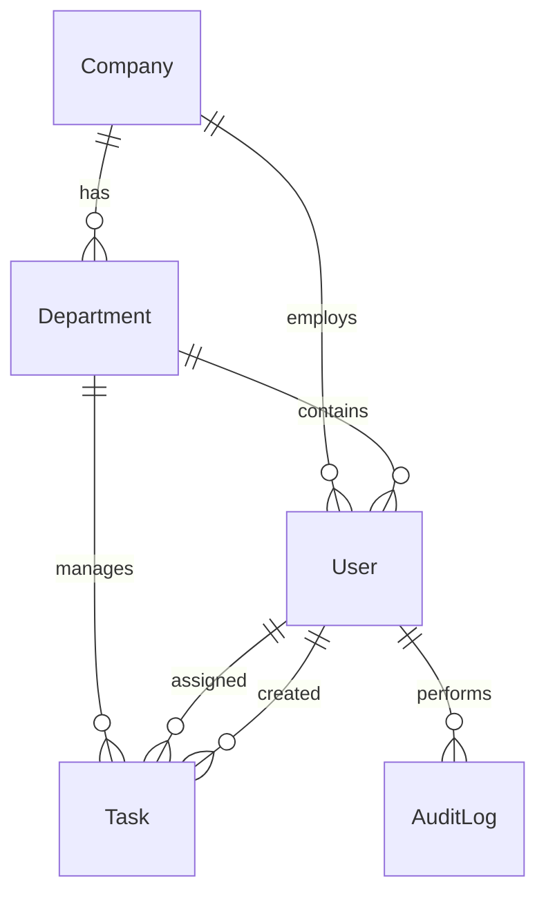

# Secure Task Management System - MVP Architecture

## System Overview

A secure task management system built with NX monorepo, featuring JWT authentication and role-based access control. Designed to be completed in 8 hours while meeting all core requirements.

## NX Monorepo Structure
```
turbovets/
├── apps/
│   ├── api/                    # NestJS Backend
│   └── dashboard/              # Angular Frontend
├── libs/
│   └── data/                   # Shared TypeScript interfaces
├── nx.json
├── package.json
└── README.md
```

## Simplified Data Models (MVP)

### Core Entities

#### Company
```typescript
interface Company {
  id: string;
  name: string;
  createdAt: Date;
}
```

#### Department
```typescript
interface Department {
  id: string;
  name: string;
  companyId: string;
  createdAt: Date;
}
```

#### User
```typescript
interface User {
  id: string;
  email: string;
  passwordHash: string;
  firstName: string;
  lastName: string;
  companyId: string;
  departmentId: string;
  role: 'owner' | 'admin' | 'viewer';  // Single role per user (simplified)
  createdAt: Date;
}
```

#### Task
```typescript
interface Task {
  id: string;
  title: string;
  description?: string;
  status: 'todo' | 'in_progress' | 'done';
  priority: 'low' | 'medium' | 'high';
  category: string;                    // Simple string (not normalized)
  assigneeId: string;
  createdById: string;
  companyId: string;
  departmentId: string;
  dueDate?: Date;
  createdAt: Date;
  updatedAt: Date;
}
```

#### AuditLog
```typescript
interface AuditLog {
  id: string;
  userId: string;
  action: string;
  resource: string;
  resourceId: string;
  timestamp: Date;
}
```

## Entity Relationships (Simplified)



## RBAC Implementation (Hardcoded for Speed)

### Role Permissions
- **Owner**: Full access to all company data
- **Admin**: Full access to department data (CRUD tasks, view users)
- **Viewer**: Read department tasks, edit only assigned tasks

### Access Control Logic
```typescript
function canAccessTask(user: User, task: Task, action: string): boolean {
  // Owner has full company access
  if (user.role === 'owner' && user.companyId === task.companyId) {
    return true;
  }
  
  // Admin has full department access
  if (user.role === 'admin' && user.departmentId === task.departmentId) {
    return true;
  }
  
  // Viewer can read department tasks
  if (user.role === 'viewer' && action === 'read' && user.departmentId === task.departmentId) {
    return true;
  }
  
  // Viewer can edit/update own tasks (not delete)
  if (user.role === 'viewer' && action !== 'delete' && task.assigneeId === user.id) {
    return true;
  }
  
  return false;
}
```

## API Endpoints (MVP)

### Authentication
- `POST /auth/login` - User login
- `POST /auth/register` - Company owner registration

### Tasks
- `GET /tasks` - List accessible tasks (filtered by role)
- `POST /tasks` - Create task
- `PUT /tasks/:id` - Update task
- `DELETE /tasks/:id` - Delete task
- `PATCH /tasks/:id/status` - Update status (for drag-drop)

### Users & Data
- `GET /users/me` - Current user profile
- `GET /departments/:id/users` - Department users (for assignment)

## Frontend Architecture

### Component Structure
```
src/app/
├── auth/
│   ├── login/
│   └── register/
├── tasks/
│   ├── task-board/
│   ├── task-form/
│   └── task-card/
├── shared/
│   └── components/
└── core/
    ├── services/
    ├── guards/
    └── interceptors/
```

### Key Features
1. **JWT Authentication** - Login/register with token storage
2. **Task Board** - Kanban-style with 3 columns (Todo, In Progress, Done)
3. **Drag & Drop** - Move tasks between status columns
4. **Task Management** - Create, edit, delete with permission checks
5. **Responsive Design** - Mobile-first with TailwindCSS
6. **Basic Filtering** - By assignee and priority

## Technology Stack

### Backend
- **NestJS** - Node.js framework
- **TypeORM** - Database ORM
- **SQLite** - File-based database (simple setup)
- **JWT** - Authentication tokens
- **bcrypt** - Password hashing

### Frontend
- **Angular 17** - Frontend framework
- **TailwindCSS** - Utility-first CSS
- **Angular CDK** - Drag and drop
- **RxJS** - Reactive programming

### Development Tools
- **NX** - Monorepo management
- **Jest** - Testing framework
- **ESLint** - Code linting

## Security Features

### Authentication
- JWT tokens with expiration
- Password hashing with bcrypt
- Protected routes with guards

### Authorization
- Role-based access control
- Resource-level permissions
- Audit logging for actions

### Data Protection
- Input validation
- SQL injection prevention (TypeORM)
- XSS protection (Angular sanitization)

## Database Schema (SQLite)

```sql
-- Companies
CREATE TABLE companies (
  id TEXT PRIMARY KEY,
  name TEXT UNIQUE NOT NULL,
  created_at DATETIME DEFAULT CURRENT_TIMESTAMP
);

-- Departments
CREATE TABLE departments (
  id TEXT PRIMARY KEY,
  name TEXT NOT NULL,
  company_id TEXT NOT NULL,
  created_at DATETIME DEFAULT CURRENT_TIMESTAMP,
  FOREIGN KEY (company_id) REFERENCES companies(id)
);

-- Users
CREATE TABLE users (
  id TEXT PRIMARY KEY,
  email TEXT UNIQUE NOT NULL,
  password_hash TEXT NOT NULL,
  first_name TEXT NOT NULL,
  last_name TEXT NOT NULL,
  company_id TEXT NOT NULL,
  department_id TEXT NOT NULL,
  role TEXT NOT NULL CHECK (role IN ('owner', 'admin', 'viewer')),
  created_at DATETIME DEFAULT CURRENT_TIMESTAMP,
  FOREIGN KEY (company_id) REFERENCES companies(id),
  FOREIGN KEY (department_id) REFERENCES departments(id)
);

-- Tasks
CREATE TABLE tasks (
  id TEXT PRIMARY KEY,
  title TEXT NOT NULL,
  description TEXT,
  status TEXT NOT NULL CHECK (status IN ('todo', 'in_progress', 'done')),
  priority TEXT NOT NULL CHECK (priority IN ('low', 'medium', 'high')),
  category TEXT NOT NULL,
  assignee_id TEXT NOT NULL,
  created_by_id TEXT NOT NULL,
  company_id TEXT NOT NULL,
  department_id TEXT NOT NULL,
  due_date DATETIME,
  created_at DATETIME DEFAULT CURRENT_TIMESTAMP,
  updated_at DATETIME DEFAULT CURRENT_TIMESTAMP,
  FOREIGN KEY (assignee_id) REFERENCES users(id),
  FOREIGN KEY (created_by_id) REFERENCES users(id),
  FOREIGN KEY (company_id) REFERENCES companies(id),
  FOREIGN KEY (department_id) REFERENCES departments(id)
);

-- Audit Logs
CREATE TABLE audit_logs (
  id TEXT PRIMARY KEY,
  user_id TEXT NOT NULL,
  action TEXT NOT NULL,
  resource TEXT NOT NULL,
  resource_id TEXT NOT NULL,
  timestamp DATETIME DEFAULT CURRENT_TIMESTAMP,
  FOREIGN KEY (user_id) REFERENCES users(id)
);
```

## Development Approach

### MVP Priorities
1. **Core Functionality** - Auth, RBAC, Task CRUD
2. **User Experience** - Clean UI, drag-drop, responsive
3. **Security** - JWT, permissions, validation
4. **Documentation** - Setup instructions, API docs

### Time-Saving Strategies
- Use Angular CLI schematics for quick generation
- Hardcode initial data (roles, statuses) instead of admin UI
- File-based SQLite for simple setup
- Focus on happy path, basic error handling
- Console logging for audit (not persistent storage)
- Single environment configuration

## Testing Strategy (Minimal)

### Backend Tests
- RBAC permission logic
- Authentication flow
- Key API endpoints

### Frontend Tests
- Authentication components
- Task service operations
- Permission guards

## Future Enhancements

If time permits or for future iterations:
- Advanced role delegation
- Real-time updates with WebSockets
- File attachments
- Advanced filtering and search
- Task comments
- Time tracking
- Mobile app

This architecture balances completeness with simplicity, ensuring all requirements are met within the 8-hour constraint while maintaining security and code quality.